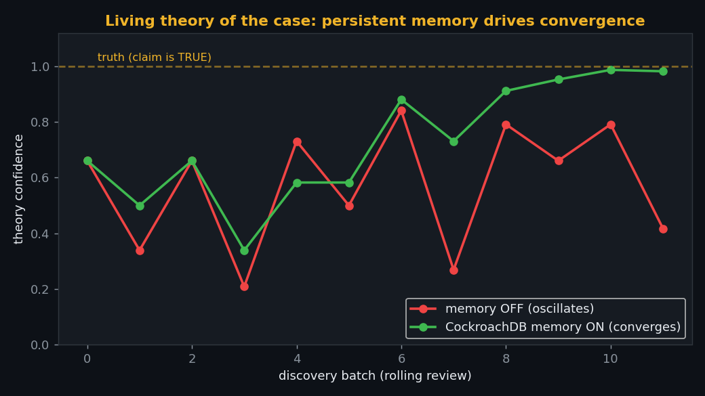
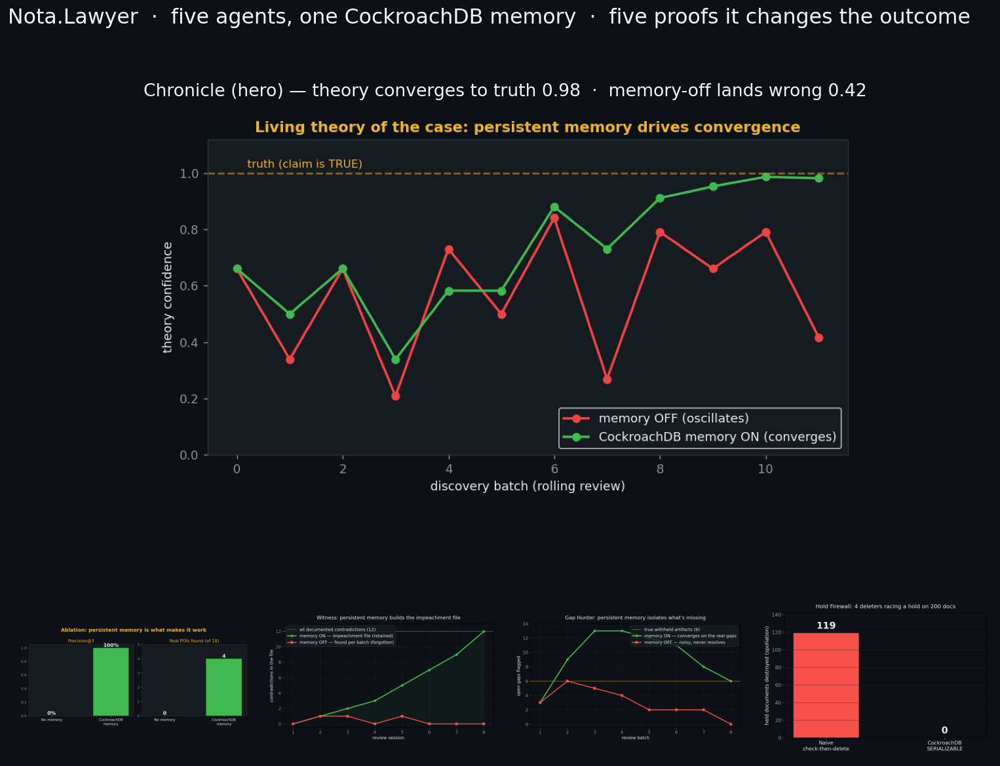

# Chronicle 📜

> Part of the **[Nota.Lawyer CockroachDB E-Discovery Suite](https://github.com/banksythequantLab/ediscovery-suite)** — five agents, one entwined memory.

**A living theory of the case.** As discovery documents stream in, Chronicle
builds and *continuously revises* a case chronology and legal theory —
extracting events, actors, and dates, resolving contradictions, and persisting
every resolution so future updates respect it. The theory is not recomputed
each run; it **accumulates and stabilizes** across sessions in CockroachDB.

> Part of the **Nota.Lawyer** agentic e-discovery suite (sibling to *Cold Case*
> and *Ledger*). Built for the CockroachDB × AWS Hackathon.

## Why this needs persistent transactional memory (not just a vector store)

Chronology reconstruction sounds like retrieval — until documents *contradict
each other* and arrive *in batches over time*. Then it becomes a memory problem:

- **Conflicts must be resolved once and stay resolved.** Email #12 says "met
  John Tuesday"; filing #45 says "John left Monday." A reviewer resolves it.
  That resolution — and its rationale — must **persist** and constrain every
  future extraction, or the agent re-litigates it every batch.
- **The theory evolves and that evolution is the product.** Monday: "fraud
  unlikely." Tuesday: three emails arrive → confidence rises → recommend
  deposing Fastow → flag missing board minutes. Without persistence, every
  session starts from zero and the theory oscillates.
- **Concurrent updates must be safe.** Multiple extraction agents update the
  same event graph at once. Under a naive store, concurrent writes silently
  clobber the true sequence (we prove this: `src/acid_demo.py`, 169/200 writes
  lost naively vs. 0 under CockroachDB `SERIALIZABLE`).

The database stores the **reasoning state** — claims, confidence, supporting and
contradicting exhibits, resolved conflicts — not just document embeddings. That
is the line between a memory system and an "LLM + vector DB" timeline demo.

## The thesis, measured

**Ablation (memory off vs. on), scored against the documented Enron chronology**
(Powers Report dates, trial timeline, bankruptcy filing):

- **Coverage / accuracy** of ~30–50 ground-truth events (event F1, date/actor accuracy).
- **Conflict-resolution success rate.**
- **Consistency / convergence:** with memory OFF, the theory oscillates as new
  contradictory batches arrive; with memory ON, it converges and stays stable.

The convergence curve — theory stabilizing toward the real case as memory
accumulates — is the "money shot," the same shape as Cold Case's 0/18→4/18.

*Proven on real CockroachDB state (`src/memory_core.py`): across a rolling
sequence of noisy discovery batches, the theory with **memory off** oscillates
and lands on the wrong conclusion (final confidence 0.42, late std-dev 0.21);
with **CockroachDB memory on**, persisted evidence anchors it — converges to
0.98 and stabilizes (std-dev 0.09).*

## Stack

- **CockroachDB** — the living theory: vector index (C-SPANN) for semantic event
  extraction, graph tables (event → actor → date → source), and ACID
  transactions for safe concurrent conflict resolution. Managed MCP Server to
  query the theory in natural language; Agent Skills for schema/ops.
- **Corpus** — 517,401 Enron emails + 22 SEC filings (shared with Cold Case).
- **Local** — Qwen3-30B (Ollama) for extraction, MiniLM embeddings on GPU.
- **AWS** — S3 for the corpus + timeline snapshots; S3 static-hosted timeline UI.

## Status

Scaffolding in progress. Schema and the deterministic memory core
(conflict detection + persisted resolution + ablation harness) first; LLM-based
event extraction layered on top.

---

## The Nota.Lawyer suite — five agents, one CockroachDB memory

Chronicle is the visual thesis for a five-agent e-discovery suite that all
share one CockroachDB-backed memory. Every agent ships with an **objective
memory ablation** — the same experiment run with persistent memory on and off —
proving that persistence doesn't just make the agent faster, it changes the
**outcome**.

| Agent | Job | Memory ablation (on vs off) | Repo |
|---|---|---|---|
| **Cold Case** | Investigate fraud, name the POIs blind | 4/18 POIs found vs 0; 100% vs 0% precision | [ColdCase](https://github.com/banksythequantLab/ColdCase) |
| **Chronicle** | Maintain the living theory of the case | converges to truth 0.98 vs oscillates to 0.42 | [Chronicle](https://github.com/banksythequantLab/Chronicle) |
| **Witness** | Build the impeachment file | 12/12 contradictions vs 3/12 | [Witness](https://github.com/banksythequantLab/Witness) |
| **Gap Hunter** | Find what's *missing* | 6/6 gaps @100% precision vs 37% | [GapHunter](https://github.com/banksythequantLab/GapHunter) |
| **Hold Firewall** | Guard against spoliation (ACID) | 0 held docs destroyed vs ~119 | [HoldFirewall](https://github.com/banksythequantLab/HoldFirewall) |

One memory backbone — vectors (C-SPANN), a communication/evidence graph, and
SERIALIZABLE transactional state — supports every agent. That is the argument
for CockroachDB over a bolt-on vector store: the memory *is* the product.

Regenerate the panel: `py -3.11 src/make_montage.py`
